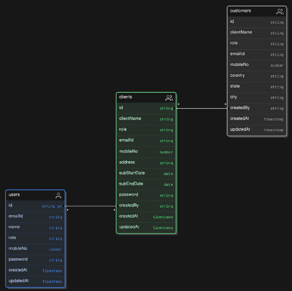
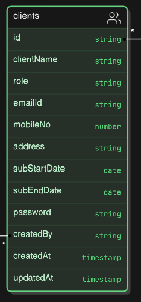
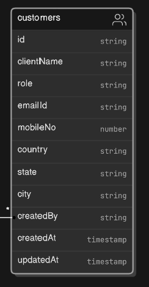

# Subscription Management Application

## Overview
### The subscription management application is designed to efficiently manage subscriptions. Developed using Angular, Node.js, and MongoDB, it provides comprehensive functionality to handle all subscription-related operations.

## Key Technologies
- Frontend: Angular
- Backend: Nodejs with Express.js
- Databased: MongoDB

## Feature 
- Admin Panel: Admin panel is central control point for administrator. [user management]
- Client Master: Client master is designed to manage client specific data & operation. [client registration, client data management, subscription management]
- Customer Master: Customer master focus on managing end user information. [customer registration, customer data management]

## Action Plan
- Collect required information.
- Backend project setup.
- Design model 

-> user model
- 
-> client model
- 
-> & customer model
- 
    [add as per requirement in future]
- Designed & developed backend
- Specify "User" route
```
/api/v1/signup 
/api/v1/login
/api/v1/logout
/api/v1/forgotPassword
/api/v1/passwordReset
/api/v1/...
```

- Specify "Client" route
```
/api/v1/clients                          (getAllClient)
/api/v1/client/:id                       (getOneClient)
/api/v1/admin/client/add                 (adminAddOneClient) 
/api/v1/admin/client/update/:id          (adminUpdateOneClient) 
/api/v1/admin/client/remove/:id          (adminRemoveOneClient) 
/api/v1/...
```

- Specify "Customer" route
```
/api/v1/customers                        (getAllCustomer)
/api/v1/customer/:id                     (getOneCustomer)
/api/v1/client/customer/add              (clientAddOneCustomer) 
/api/v1/client/customer/update/:id       (clientUpdateOneCustomer) 
/api/v1/client/customer/remove/:id       (clientRemoveOneCustomer) 
/api/v1/...
```

- Test backend using postman
- Frontend project setup
- Design UI & consume api
- Write test script
- Design ci/cd
- Setup docker, create image
- Deploy using AWS Services